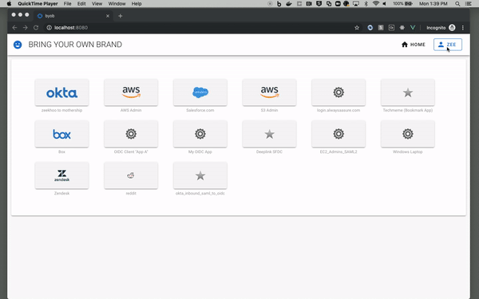

# Proxy API calls to Okta
The Single Page App (SPA) would need to call Okta APIs (*For Example, to update the users' own profile/password or configure factors, see [Manage Okta resources by API](https://developer.okta.com/docs/reference/#manage-okta-resources) for more info*) but the Okta API endpoints are protected by API keys ([SSWS key](https://developer.okta.com/docs/reference/api-overview/#authentication)) that cannot be stored on the client side. However, the SPA has an **access_token** that can authenticate its *own apis*. So in order to securely call Okta endpoints, the SPA would call its own API (protected by the access_token), and then the API (a Lambda, *which can store secrets*) proxies calls to Okta with the SSWS key.



---

**If you chose not to use the Makefile, deploy using these steps:**

## Prerequisites
* Install [Serverless](https://www.serverless.com/framework/docs/getting-started/)

    e.g. via npm:
    ```
    npm install -g serverless
    ```

## Deploy
* Update the `serverless.yml` file with your environment variables:
```
custom:
  region: ${opt:region, self:provider.region}
  stage: ${opt:stage, self:provider.stage}
  ssmPrefix: byob
  ssmParameters:
    OKTA_ISSUER: "/${self:custom.ssmPrefix}/okta/${self:custom.stage}/issuer-uri"
    OKTA_AUDIENCE: "/${self:custom.ssmPrefix}/okta/${self:custom.stage}/audience"
    OKTA_CLIENT_ID: "/${self:custom.ssmPrefix}/okta/${self:custom.stage}/client-id"
    OKTA_API_TOKEN: "/${self:custom.ssmPrefix}/okta/${self:custom.stage}/api-token"
    RECAPTCHA_SITE_SECRET: "/${self:custom.ssmPrefix}/okta/${self:custom.stage}/recaptcha-site-secret"
```

* Run the serverless deploy command
    ```
    sls deploy
    ```